```{r setup, include=FALSE}
options(htmltools.dir.version = FALSE)
knitr::opts_chunk$set(
  fig.width=9, fig.height=3.5, fig.retina=3,
  out.width = "100%",
  cache = FALSE,
  echo = TRUE,
  message = FALSE, 
  warning = FALSE,
  hiline = TRUE
)
```

```{r xaringan-themer, include=FALSE, warning=FALSE}
library(xaringanthemer)
style_duo_accent(
  primary_color = "#4548ff",
  secondary_color = "#070714",
  inverse_header_color = "#FFFFFF"
)
```

class: inverse center middle

# Consideraciones técnicas

---
# Requerimientos

Para poder replicar los 2 ejercicios propuestos es necesario contar con la instalación y configuracion de los siguientes softwares y datos: 

Software | Datos
---|---
- QGIS         |  - [📥 Pronostico y datos I](https://github.com/ambarja/CRA-PBI/raw/main/resources/Ni%C3%B1oCostero/datos_ni%C3%B1o2017.gpkg)
- R & Rstudio  |  - [📥 Pronostico y datos II](https://github.com/ambarja/CRA-PBI/raw/main/resources/Tifon/datos_tifon2020.gpkg)

*Paquetes dentro del software R:*
 - `tidyverse`
 - `rgee`
 - `sf`
 - `mapview`
---
# Flujo de trabajo 
<br>
<br>
<br>
<p align="center"></p>
---
# Trabajando con el software QGIS 

<p align="center"></p>

---

class: inverse center middle

# Ejemplo para el <br>🌧️ Niño Costero 2017 Perú

---
# Descargando información de pronóstico

.pull-left[
 
]

.pull-right[
 
]

---
# Niño 2017
.pull-left[

]

.pull-right[

]

.footnote[[📥 Clic para descargar ejemplo](https://www.senamhi.gob.pe/?p=aviso-meteorologico-detalle&a=2017&b=034&c=022&d=SENA)]

---
# Lectura e intersección de capas vectoriales
<p align="center"></p>
---
# Estadística zonal 

<p align="center"></p>
.footnote[[📥 Clic para descargar ejemplo](https://data.humdata.org/dataset/peru-high-resolution-population-density-maps-demographic-estimates)]
---
# Tabla de resumen

```{r echo=FALSE, message=FALSE,warning=FALSE}
library(tidyverse)
library(kableExtra)
read.csv("resources/csv/niño_tabla.csv") %>% 
  as_tibble() %>% 
  arrange(desc(IR2)) %>% 
  head(6) %>% 
  knitr::kable(format = "html",caption = "Posibles distritos de mayor afectación")
```
---
class: inverse center middle

# Ejemplo para el <br>🌀 Tifón Molave Vietnam 2020

---
# Descargando información de pronóstico

.pull-left[
 
]

.pull-right[
 
]
---
# Lectura y georreferenciación

<p align="center"></p>

---
# Digitalización y estadística zonal 
<p align="center"></p>
.footnote[[📥 Clic para descargar datos de población](https://data.humdata.org/dataset/vietnam-high-resolution-population-density-maps-demographic-estimates)]
---
# Tabla de resumen 

```{r echo=FALSE, message=FALSE,warning=FALSE}
library(tidyverse)
library(kableExtra)
read.csv("resources/csv/tifon_example.csv") %>% 
  as_tibble() %>% 
  dplyr::select(ADM1_EN,Pronostico,`niños.05`,`adultos.60`) %>% 
  head(5) %>% 
  knitr::kable(format = "html",caption = "Tabla de niños y adultos por admin")

read.csv("resources/csv/nieveles_pop.csv") %>% 
  knitr::kable(format = "html",caption = "Tabla de poblacion por niveles")
```

---
class: inverse center middle

# Intento de automatizar la generación de reportes 

---
# Lectura de pronóstico e información de riesgo

```{r, eval=FALSE,out.width="100%"}
library(tidyverse)
library(sf)
library(mapview)
library(rgee)
ee_Initialize(user = "antony.barja@upch.pe)
```

```{r, echo=FALSE,message=FALSE}
library(sf)
library(mapview)
```

```{r, echo=FALSE,out.width="100%"}

pronostico <- st_read("resources/Tifon/datos_tifon2020.gpkg",layer = "pronostico",quiet = T)
limites <- st_read("resources/Tifon/datos_tifon2020.gpkg",layer = "admin1",quiet = T)
mapview(pronostico)
```


---

# Estadística zonal 
```{r, eval=FALSE}
zona_impactada <- function(x){ 
  # Nivel de pronostico 
  nivel <- pronostico[x,]
  # Intersección de capas
  nuevos_limites <- st_intersection(x = limites,y = nivel) %>% 
    dplyr::select(ADM1_EN,value) %>% 
    sf_as_ee()
  # Datos de población de Earth Engine
  poblacion_estimada <- ee$ImageCollection$Dataset$WorldPop_GP_100m_pop$
    select('population')$
    filter(ee$Filter$calendarRange(2020,2020, "year"))$
    mosaic()$
    rename('pop')
 # Estadistica zonal 
  stat_general <- ee_extract(
    x = poblacion_estimada,
    y = nuevos_limites,
    fun = ee$Reducer$sum(),
    scale = 100)
  stat_final <- stat_general %>% 
    mutate(pop = round(pop,0))
  return(stat_final)
}
```

---
# Generación de reporte
```{r, eval=FALSE}
# Resultados finales en listas
lista_stat <- lapply(X = 1:3,FUN = zona_impactada) 

# Tabla final por valores
datos_finales <- lista_stat %>% 
  map_df(.f = as_tibble) %>% 
  group_by(value) %>% 
  summarise(pop = sum(pop,na.rm = TRUE))
```

```{r,echo=FALSE}
read_csv("resources/csv/nieveles_pop.csv") %>% 
  kable(format = "html",caption = "Tabla de poblacion posiblemente afectada por niveles de pronóstico")
```


---
class: center, middle

# Gracias!

Slides creados con los siguientes paquetes de  R:

[**xaringan**](https://github.com/yihui/xaringan)<br>
[gadenbuie/xaringanthemer](https://github.com/gadenbuie/xaringanthemer)

The chakra comes from [remark.js](https://remarkjs.com), [**knitr**](http://yihui.name/knitr), and [R Markdown](https://rmarkdown.rstudio.com).